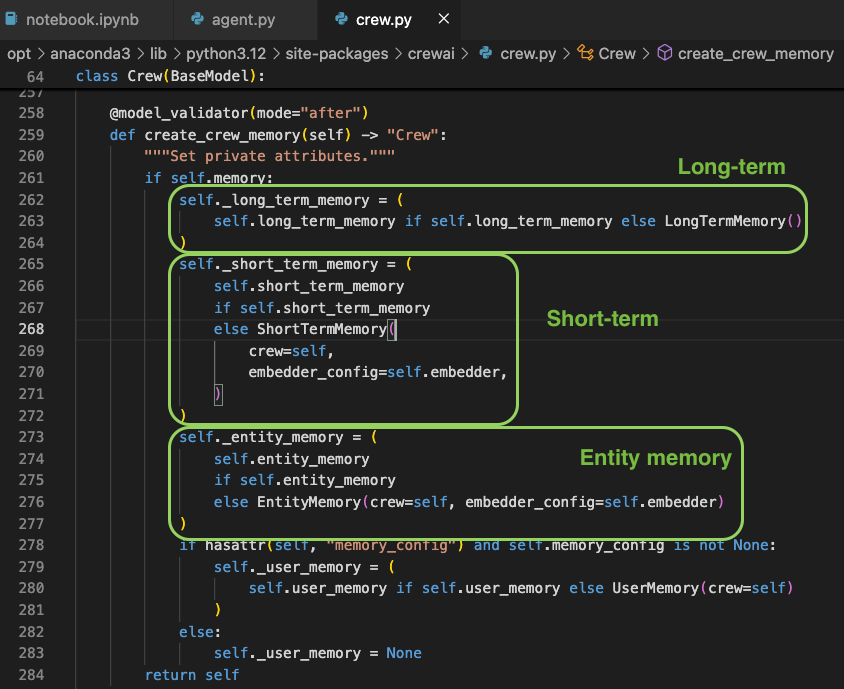
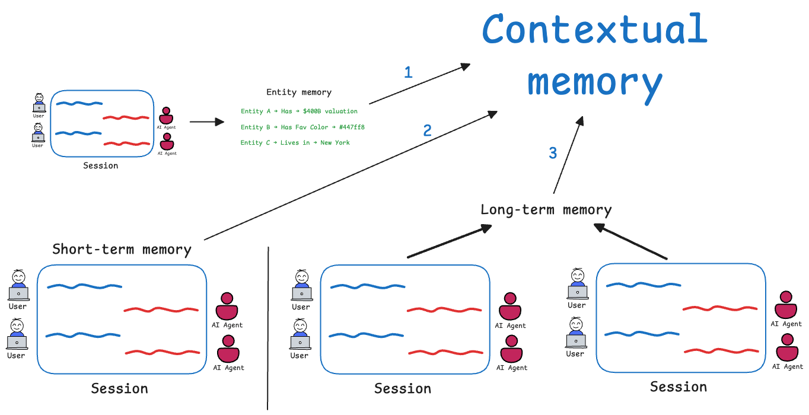
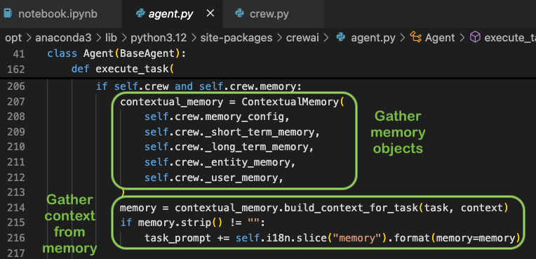

## 🧠 Knowledge Integration for AI Agents using CrewAI

In this guide, you'll learn how to enable AI agents to:

* 📁 Access a company knowledge base
* 📊 Query structured datasets like CSV or JSON
* 📄 Read and recall insights from PDFs, DOCs, and other documents
* ❓ Answer questions based on internal documentation


### 📌 What is "Knowledge for Agents"?

**Knowledge for Agents** refers to the **information and context required by an AI agent to reason, plan, and act intelligently**.

This knowledge may include:

* **Facts** – e.g., product specs, employee roles, pricing rules
* **Documents** – e.g., HR policies, SOPs, technical manuals
* **Tools** – e.g., APIs, databases (to interact with or query)
* **Memory** – e.g., past interactions, actions, or decisions
* **World Knowledge** – e.g., common sense, public information

> 💡 *Example:* If you're building a **travel booking agent**, its knowledge might include airline schedules, pricing APIs, visa regulations, and the user's trip history.

<br>

### 📌 Knowledge in CrewAI

CrewAI allows agents to use knowledge in two main ways:

##### 🔹 Agent-Level Knowledge

* Assigned directly to an agent.
* Ideal for *specialized roles* (e.g., a product assistant that knows only about product info).

##### 🔸 Crew-Level Knowledge

* Shared among multiple agents in the same crew.
* Suitable for *collaborative tasks* (e.g., marketing, support, and sales agents referencing the same product launch document).

📓 **Notebook**: `01 - Knowledge For Agents`

<br>

### 📌 Supported Knowledge Formats

You can load a variety of knowledge sources:

* `.txt`, `.pdf`, `.md`
* `.csv`, `.xlsx` (Excel)
* `.json`
* Custom APIs (via wrappers)
* Raw string input (e.g., from databases or internal tools)

<br>

### 📌 Example: Load Knowledge from a Text File

To load a `.txt` file as a knowledge source in CrewAI:

```python
from crewai.knowledge.source.text_file_knowledge_source import TextFileKnowledgeSource

text_source = TextFileKnowledgeSource(
    file_paths=["hr_policy.txt"]
)
```

<br>


### 📌 Knowledge vs Tools

| Concept       | Description                                                               |
| ------------- | ------------------------------------------------------------------------- |
| **Knowledge** | Passive information embedded in agents (e.g., policy docs, feature specs) |
| **Tools**     | Active components the agent can use in real time (e.g., APIs, databases)  |


### 📌 Use Cases

* A **support agent** referencing product FAQs or refund policies stored in PDF/Markdown.
* A **sales agent** accessing a shared CRM dump in `.csv` to answer customer queries.
* An **HR agent** parsing internal policy documents in `.docx` or `.txt`.


<br><br>

## 🧠 **Memory in Agentic Systems**

So far, our agents have been **stateless**—they don’t retain any information from prior interactions. But what if we want agents to:

* **Recall** previous conversations
* **Accumulate knowledge** throughout a session
* **Personalize responses** based on user history

👉 **Solution: Introduce Memory**

Let’s explore how memory empowers agents to behave more intelligently and contextually.


### 🧾 **What is Memory?**

Memory is a mechanism that allows an agent to **store and recall information** from past interactions, enabling **context continuity**, **long-term learning**, and **personalized behavior**.


### 🧩 **Types of Memory**

* **Short-Term Memory**
  Retains recent context within the current session for coherent interactions.

* **Long-Term Memory**
  Stores accumulated knowledge and insights across multiple sessions.

* **Entity Memory**
  Tracks information about specific entities (e.g., people, places, products) to ensure consistency when they’re referenced later.

* **User Memory**
  Maintains details about individual users, enabling personalized and user-specific responses.


📓 **Notebook**: `02 - Memory in Agents`


### 🛠️ **How Memory Works in CrewAI**



CrewAI integrates memory modules that allow agents to **retrieve, update, and store knowledge dynamically**, making them more adaptive, context-aware, and capable of long-term reasoning.


<br><br>

## 🧠 **Memory Deep-Dive**

To build intelligent, personalized agents, CrewAI supports multiple types of memory—each with a specific purpose and storage mechanism. Let’s explore them in detail:


### 1. 🔄 **Short-Term Memory**

* Acts as the agent’s **working memory** during the current session.
* Implemented using a **RAG (Retrieval-Augmented Generation)** approach:

  * Embeds recent results into a **vector store** (e.g., ChromaDB).
  * Retrieves the most relevant chunks as **context** for new user inputs.
* To enable: set `memory=True` in the `Crew` configuration.


### 2. 💾 **Long-Term Memory**

* Stores **persistent knowledge** across sessions.
* Useful for retrieving **task-level summaries** or results from past sessions.
* CrewAI uses **SQLite** to store and retrieve task outputs from disk.


### 3. 🧩 **Entity Memory**

* Tracks and organizes information about **specific entities** (e.g., people, organizations, products).
* Builds a **profile or knowledge base** per entity.
* Also implemented using **vector store + RAG**, similar to short-term memory.


### 4. 🧠 **Contextual Memory**

* Dynamically merges relevant information from:

  * **Short-Term**,
  * **Long-Term**, and
  * **Entity** memories
* Provides a unified and coherent context for reasoning.





### 5. 🙋‍♂️ **User Memory**

* Stores **user-specific data** and preferences to enable **personalization**.
* Memory is tied to a `user_id`.
* CrewAI integrates **Mem0** to manage user-level memory efficiently.


### 🔁 **Resetting Memory**

You can selectively reset different memory types as needed:

```python
# Reset all memories
crew.reset_memories(command_type='all')

# Reset specific types
crew.reset_memories(command_type='short')
crew.reset_memories(command_type='long')
crew.reset_memories(command_type='entities')
```