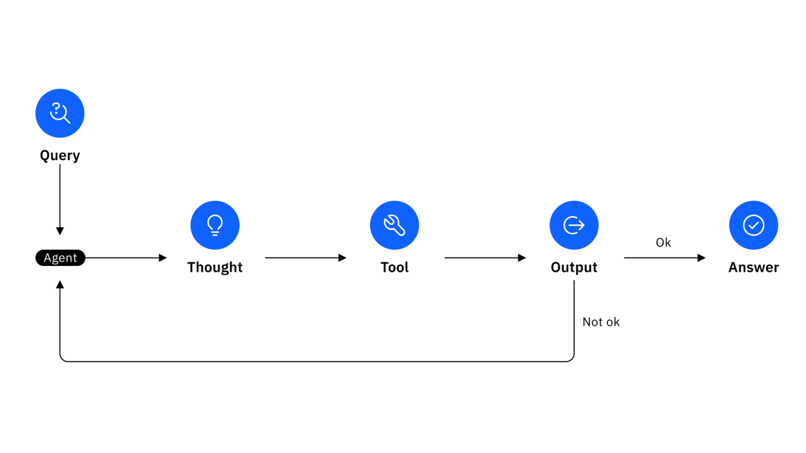
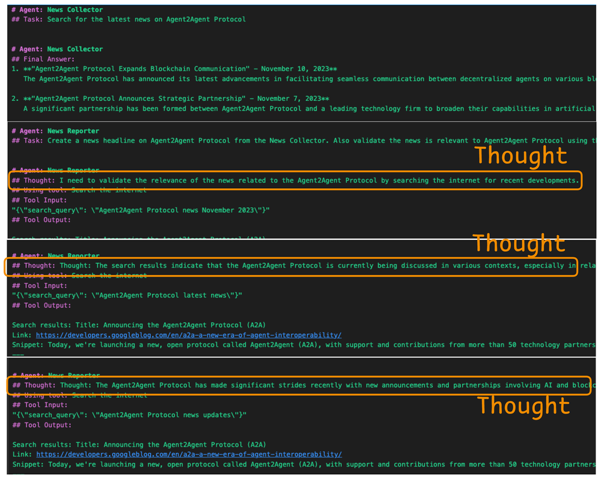

## 🤖 ReAct Pattern for AI Agents with CrewAI

In this guide, you’ll learn how the **ReAct (Reasoning + Acting)** pattern empowers LLMs to:

* 🧠 Think step-by-step through complex problems (Chain-of-Thought)
* 🔧 Interact with external tools like search engines, calculators, or APIs
* 🔄 Use observations from tools to inform next reasoning steps
* 🎯 Produce clear, traceable reasoning chains for better debugging and control




### 📌 What is the ReAct Pattern?

The **ReAct pattern** combines **thoughtful reasoning** with **actionable tool use**, allowing AI agents to solve complex tasks by:

* Breaking down problems into logical steps (Reasoning)
* Taking actions to gather data or perform operations (Acting)
* Observing results and adjusting their reasoning accordingly (Observing)

> 💡 *Example:* To answer “What is the population of the country where the Eiffel Tower is located?” the agent thinks about the Eiffel Tower’s location, searches for the population, observes the result, then concludes the final answer.


### 📌 Why Use ReAct?

ReAct helps AI models by:

* Forcing **step-by-step problem solving**
* Clearly separating **thinking from acting**
* Guaranteeing **deterministic and traceable interactions** with external tools
* Making reasoning **transparent and inspectable** for debugging or audit


### 📌 How Does ReAct Work?

ReAct runs in a loop of:

1. **Thought:** The model reasons about the problem.
2. **Action:** The model issues a command to an external tool.
3. **Observation:** The model receives results from the tool.
4. Repeat until a **final answer** is produced.




Each Thought and Observation is appended to the conversation context, so the model “remembers” all prior steps.

> ⚙️ Implemented via **prompt templates and parsing logic**—no special built-in LLM features required.


### 📌 ReAct in the Real World

```bash
90% of AI apps today =
🧠 Clever prompt engineering
🔧 Smart parsing and tool orchestration
💸 And boom... *PROFIT!* 😎

Prompt → Parse → Profit™
```


### 📌 Getting Started with CrewAI and ReAct

CrewAI provides a seamless implementation of the ReAct pattern so you can:

* Build AI agents that reason and act autonomously
* Integrate custom tools and APIs easily
* Trace and debug reasoning chains effortlessly

📓 **Notebook:** `01 - ReAct From Scratch`

